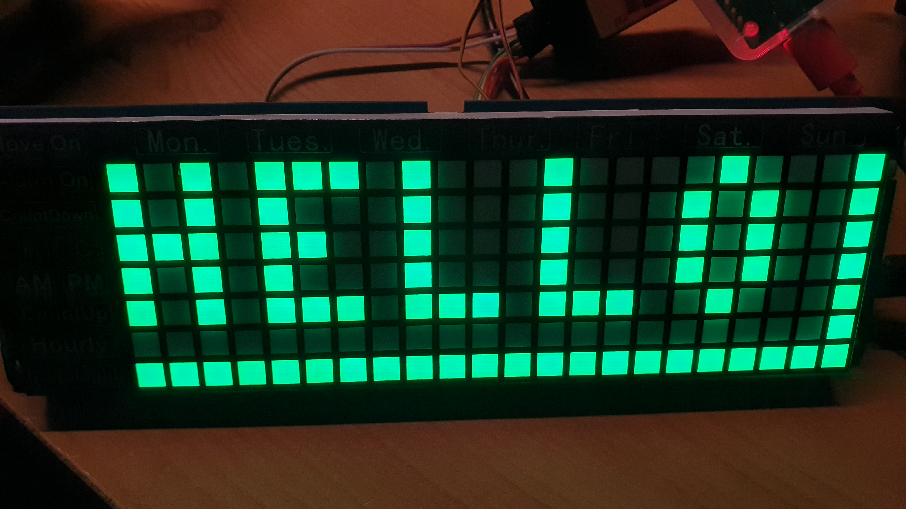

# rp2040-pio-ws19695-led-display

Waveshare Electronics [Pico-Clock-Green (a.k.a. ws-19695)](https://www.waveshare.com/pico-clock-green.htm)
contains a large LED matrix display which is driven by two SM16106 shift registers
and one SM5166P address decoder.

This project creates a controller for Pico-Clock-Green display using Raspberry Pi
Pico (RP2040) PIO and DMA functions, thus taking no CPU cycles for controlling
and refreshing of LED matrix display.

There is also a custom display driver included for using ws-19695 pio controller
together with [olikraus'](https://github.com/olikraus) excellent 
[u8g2 monochrome display library](https://github.com/olikraus/u8g2).
This opens up all possibilities of using ws-19695 as a standard LED matrix display
without the need of writing any graphic output code.

Please note that this project uses git submodules. Clone project code using 
`git clone --recurse-submodules`.
